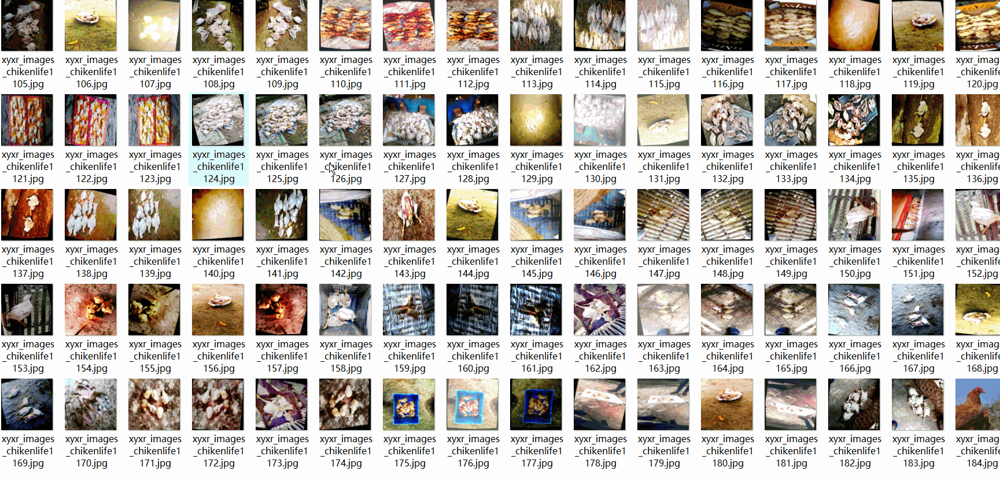
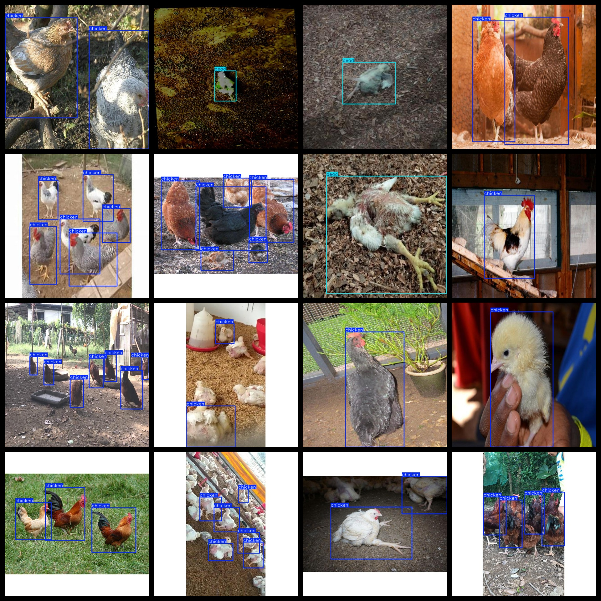

# Live Chicken Dead Chicken Dataset 9876 imagesVOC+YOLO

Live Chicken Dead Chicken Dataset 9876stretchVOC+YOLO

Dataset format: Pascal VOC format + YOLO format (the txt file does not contain the split path, it only contains jpg images and corresponding VOC format xml files and yolo format txt files)

Number of images (number of jpg files): 9876

Number of xml files: 9876

Number of annotations (number of txt files): 9876

Label count: 2

The Github repository is: datasets_sl

["dead","chicken"]

Number of boxes labeled in each category:

The number of frames for "chicken" is 54959.

Dead Frame Count = 4376

Total frames: 59335

Number of images per category:

chicken annotated images = 8307

Dead occupancy = 1571

Image resolution: 640x640

Use the labeling tool: labelImg

Dataset Augmentation: Yes

Rules for annotation: Draw a rectangle around the category.

Important note: The dataset does not have been divided into training, validation, and testing sets.

Special Disclaimer: This dataset does not guarantee the accuracy of the trained models or weight files.

Annotation and image details are as follows:

## Images

---

Here is a pay link on Stripe (https://buy.stripe.com/3cs8yP7sY87d0vu9AB). Please contact me lonlonago@foxmail.com after funding $89, and I will send you a complete data files, thank you!

